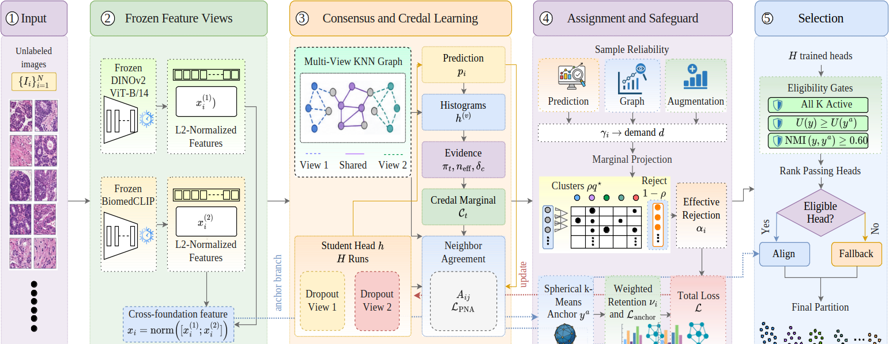
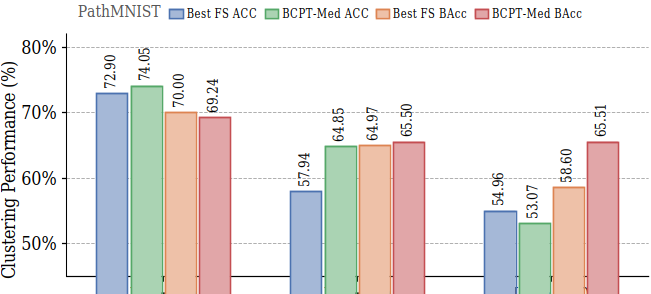
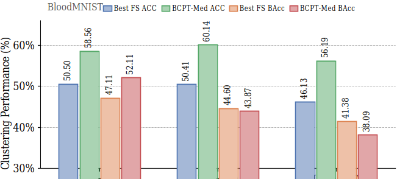

# BCPT-Med: Credal Bounded-Consensus Partial Transport for Imbalanced Medical Image Clustering


BCPT-Med is an offline-first framework for clustering imbalanced medical image collections with frozen complementary foundation encoders. It combines a cross-foundation consensus graph, an interval-valued **credal cluster marginal**, reliability-aware **partial optimal transport with rejection**, and an anchor-guided label-free safeguard.

The implementation follows the paper protocol: semantic labels are excluded from feature extraction, graph construction, optimization, hyperparameter selection, and head selection. Labels are used only after the final partition is selected to compute clustering metrics. The number of clusters, \(K\), is assumed known from the dataset metadata.

---

## Method overview

<p align="center">
  
</p>

BCPT-Med separates three decisions that are often conflated in imbalanced clustering:

1. **Where accepted mass may go.** DINOv2 and BiomedCLIP predictions are smoothed over view-specific graphs. Their agreement, disagreement, and effective sample support define lower and upper bounds for each cluster proportion rather than forcing a uniform or prematurely fixed prior.
2. **Which samples may contribute.** Predictive confidence, cross-view graph agreement, and feature-dropout consistency determine sample reliability. Entropic partial transport sends unreliable mass to an explicit reject column, and accepted mass remains unnormalized in the loss so weakly accepted samples exert less influence.
3. **Which trained partition may be returned.** A spherical \(k\)-means anchor provides decaying training retention, label-free quality gates, cross-head stability checks, aligned blending, and fallback when no candidate head is structurally credible.

### End-to-end pipeline

```text
Unlabeled medical images
        │
        ├── Frozen DINOv2 features ─────┐
        └── Frozen BiomedCLIP features ─┤
                                        ▼
                         Reciprocal consensus graph
                                        │
                  ┌─────────────────────┴────────────────────┐
                  ▼                                          ▼
       EMA teacher + graph smoothing                 Spherical k-means anchor
                  │                                          │
                  ▼                                          ▼
      Credal marginal [lower, upper]          Retention, gate, blend, fallback
                  │
                  ▼
       Reliability-weighted batch demand
                  │
                  ▼
      Projection into bounded simplex
                  │
                  ▼
 Partial Sinkhorn transport + reject column
                  │
                  ▼
      Student update and EMA teacher update
                  │
                  ▼
       Label-free multi-head selection
```

---

## Main contributions

- **Cross-foundation credal marginal:** cluster-specific occupancy intervals reflect encoder disagreement and effective reliable sample size.
- **Reliability-aware partial transport:** an explicit reject column controls uncertain assignments without renormalizing rejected mass back into full pseudo-labels.
- **Anchor-guided safeguard:** decaying anchor retention and label-free structural gates reduce seed sensitivity while preserving fallback behavior.
- **Controlled evaluation:** clean, long-tail, component-ablation, and safeguard-stress protocols use identical frozen features and fixed training budgets.

---

## Repository layout

```text
BCPT-MED-main/
├── README.md
├── code/
│   └── BCPT_Med.py          # Complete implementation and CLI
├── figs/
│   └── bcpt-med.png         # Methodology figure
├── graphs/
│   ├── path-long-tail.png   # PathMNIST long-tail results
│   └── blood-long-tail.png  # BloodMNIST long-tail results
└── data/
    ├── global_summary.csv
    ├── global_summary_stress-corrupted_graph.csv
    ├── global_summary_stress-distribution_shift.csv
    ├── global_summary_stress-noisy_encoder.csv
    ├── global_summary_stress-reduced_sample.csv
    ├── global_summary_stress-weak_anchor.csv
    └── global_summary_stress-wrong_k.csv
```

---

## Code tour

The complete experiment is implemented in [`code/BCPT_Med.py`](code/BCPT_Med.py). The main sections are:

| Code area | Main objects | Role |
|---|---|---|
| Data and encoders | `load_medmnist_dataset`, `build_encoder`, `load_medmnist_views` | Loads MedMNIST and extracts or reuses frozen encoder features. |
| Controlled imbalance and stress | `make_long_tailed_indices`, `apply_feature_stress`, `corrupt_graph_tensors` | Creates long-tail subsets and safeguard stress conditions. |
| Multi-view graph | `cosine_knn`, `build_consensus_graph` | Builds view-specific neighborhoods, reciprocal consensus weights, and agreement scores. |
| Anchor initialization | `spherical_kmeans_init` | Creates the label-free spherical \(k\)-means anchor and prototype initialization. |
| Credal marginal | `CredalConsensusMarginal`, `project_box_simplex` | Estimates bounded cluster proportions and projects batch demand into the feasible simplex. |
| Partial transport | `bounded_partial_sinkhorn` | Solves reject-augmented entropic transport with bounded real-cluster demand. |
| BCPT-Med head | `ClusterHead`, `BCPTConfig`, `train_one_head` | Trains student/EMA-teacher heads with neighborhood, transport, anchor, and self-label losses. |
| External comparisons | `train_scan_fs`, `train_p2ot_fs`, `train_sp2ot_fs`, `train_protocol_fs` | Runs controlled feature-space adaptations with the same frozen representations. |
| Label-free safeguard | `label_free_partition_quality`, `select_guarded_bcpt_head`, `align_anchor_probs` | Applies active-cluster, graph-quality, anchor-NMI, stability, blending, and fallback rules. |
| Evaluation and reporting | `compute_metrics`, `write_pairwise_significance`, `write_latex_table` | Produces seed-level metrics, diagnostic CSVs, significance tests, and paper tables. |
| Experiment orchestration | `run_one_dataset`, `run_suite`, `run_aaai_final_suite` | Runs clean, ablation, imbalance, and stress-test suites. |

---

## Installation

A CUDA-capable GPU is recommended for feature extraction and multi-head training. CPU execution is supported through `--cpu` but will be substantially slower.

### 1. Create an environment

```bash
python -m venv .venv
source .venv/bin/activate
```

On Windows:

```powershell
python -m venv .venv
.venv\Scripts\activate
```

### 2. Install PyTorch

Install `torch` and `torchvision` for your operating system and CUDA configuration before running the script. The implementation imports PyTorch before processing CLI options.

### 3. Install the remaining dependencies

```bash
python code/BCPT_Med.py --install
```

The installer adds MedMNIST, scikit-learn, SciPy, pandas, matplotlib, tqdm, Pillow, OpenCLIP, Hugging Face Hub, and timm.

---

## Offline model assets

The implementation deliberately loads DINOv2 and BiomedCLIP from local files. By default, it expects an `offline_pack` directory beside `BCPT_Med.py`:

```text
code/offline_pack/
├── medmnist/
│   ├── pathmnist_224.npz
│   └── bloodmnist_224.npz
├── torch_hub/
│   ├── dinov2/
│   └── checkpoints/
│       └── dinov2_vitb14_pretrain.pth
└── hf_home/local_models/
    ├── BiomedCLIP-PubMedBERT_256-vit_base_patch16_224/
    └── BiomedNLP-BiomedBERT-base-uncased-abstract/
```

A different asset root can be supplied with either:

```bash
export BCPT_OFFLINE_PACK=/absolute/path/to/offline_pack
```

or:

```bash
python code/BCPT_Med.py \
  --offline-pack-dir /absolute/path/to/offline_pack \
  --datasets pathmnist \
  --encoders dinov2_vitb14 biomedclip \
  --methods bcpt_med
```

Use `--no-auto-download` to require MedMNIST files to exist locally rather than allowing the MedMNIST loader to acquire missing dataset files.

---

## Reproduce the requested PathMNIST ablation

From the repository root:

```bash
python code/BCPT_Med.py \
  --datasets pathmnist \
  --encoders dinov2_vitb14 biomedclip \
  --methods bcpt_pmi bcpt_uniformot bcpt_bounded_full bcpt_med \
  --epochs 60 \
  --seeds 0 1 2 3 4 \
  --n-heads 5 \
  --baseline-heads 5 \
  --batch-size 512 \
  --out-root ./bcpt_ablation
```

The same command in the requested form can be run from the `code/` directory:

```bash
cd code
python BCPT_Med.py \
  --datasets pathmnist \
  --encoders dinov2_vitb14 biomedclip \
  --methods bcpt_pmi bcpt_uniformot bcpt_bounded_full bcpt_med \
  --epochs 60 \
  --seeds 0 1 2 3 4 \
  --n-heads 5 \
  --baseline-heads 5 \
  --batch-size 512 \
  --out-root ../bcpt_ablation
```

### Variants in this ablation

| CLI method | Configuration | Question tested |
|---|---|---|
| `bcpt_pmi` | Credal prior-normalized neighborhood agreement without OT or anchor safeguards | Is the cross-foundation credal neighborhood signal sufficient by itself? |
| `bcpt_uniformot` | Uniform full-transport target without reliability, rejection, or safeguards | What happens when transport retains a balanced fixed marginal? |
| `bcpt_bounded_full` | Credal bounded transport with full accepted mass | Does a bounded nonuniform marginal help without explicit rejection? |
| `bcpt_med` | Credal bounded partial transport, reliability weighting, self-labeling, anchor retention, gate, fallback, and blending | What is gained by the complete framework? |

---

## Additional commands

### Verify numerical invariants

Checks bounded-simplex feasibility and partial-transport mass conservation.

```bash
python code/BCPT_Med.py --self-test
```

### List supported methods

```bash
python code/BCPT_Med.py --list-methods
```

### Short sanity run

```bash
python code/BCPT_Med.py --quick --methods bcpt_med
```

### Cross-foundation paper configuration

```bash
python code/BCPT_Med.py --cross
```

### Controlled long-tail evaluation

```bash
python code/BCPT_Med.py \
  --datasets pathmnist bloodmnist \
  --encoders dinov2_vitb14 biomedclip \
  --methods p2ot sp2ot protocol bcpt_med \
  --imbalance-ratio 50 \
  --imbalance-seed 0 \
  --epochs 60 \
  --seeds 0 1 2 3 4 \
  --out-root ./bcpt_ir50
```

### Complete paper evidence suite

Runs clean comparisons, component ablations, imbalance ratios 10/50/100, and all safeguard stress tests.

```bash
python code/BCPT_Med.py \
  --aaai-final-suite \
  --datasets pathmnist bloodmnist \
  --encoders dinov2_vitb14 biomedclip \
  --epochs 60 \
  --seeds 0 1 2 3 4 \
  --n-heads 5 \
  --baseline-heads 5 \
  --out-root ./bcpt_paper_suite
```

### Resume completed seeds

```bash
python code/BCPT_Med.py \
  --datasets pathmnist \
  --encoders dinov2_vitb14 biomedclip \
  --methods bcpt_med \
  --seeds 0 1 2 3 4 \
  --reuse-existing \
  --out-root ./bcpt_ablation
```

A method is reused only when all requested seed rows are present; missing seeds are rerun.

---

## Output files

For the requested command, dataset-specific artifacts are written under:

```text
bcpt_ablation/pathmnist/dinov2_vitb14+biomedclip/
```

Typical outputs include:

| File | Contents |
|---|---|
| `summary.csv` | Mean and standard deviation for all requested methods. |
| `all_seed_results.csv` | Per-method, per-seed metrics and method diagnostics. |
| `diagnostic_summary.csv` | Aggregated training, selection, transport, runtime, and memory diagnostics. |
| `per_class_recall.csv` | Per-class recall for post-hoc evaluation. |
| `paired_significance.csv` | Paired two-sided Wilcoxon tests with Holm correction against BCPT-Med. |
| `external_comparison.csv` | Paper-facing external comparison subset when those methods are present. |
| `ablation_summary.csv` | BCPT variant and component-ablation results. |
| `table.tex` | Full LaTeX results table. |
| `external_comparison_table.tex` | External-comparison LaTeX table. |
| `ablation_table.tex` | Ablation LaTeX table. |
| `run_config.json` | Dataset, feature, graph, method, seed, and protocol metadata. |
| prediction bundles | Stored predictions and probabilities used for reproducibility and recovery. |

A suite-level `global_summary.csv` is also written directly under `--out-root`.

---

## Main clean-set results

All methods below use identical frozen DINOv2 ViT-B/14 and BiomedCLIP features. Values are mean ± standard deviation over five seeds. `FS` denotes a controlled feature-space adaptation rather than a byte-for-byte reproduction of the original end-to-end pipeline.

### PathMNIST

| Method | ACC | NMI | ARI | Macro-F1 | Balanced ACC |
|---|---:|---:|---:|---:|---:|
| Spherical \(k\)-means | 0.8465 ± 0.002 | 0.8738 ± 0.000 | 0.8372 ± 0.001 | 0.7921 ± 0.001 | 0.8051 ± 0.002 |
| Spectral-\(k\)NN | 0.8121 ± 0.000 | 0.9021 ± 0.000 | 0.8115 ± 0.000 | 0.6829 ± 0.000 | 0.7203 ± 0.000 |
| P²OT-FS | 0.7540 ± 0.015 | 0.7989 ± 0.013 | 0.6961 ± 0.011 | 0.7196 ± 0.023 | 0.7403 ± 0.029 |
| SP²OT-FS | 0.8057 ± 0.041 | 0.8561 ± 0.025 | 0.7974 ± 0.035 | 0.7373 ± 0.062 | 0.7596 ± 0.061 |
| PROTOCOL-FS | 0.8134 ± 0.029 | 0.8840 ± 0.019 | 0.8248 ± 0.024 | 0.7458 ± 0.045 | 0.7734 ± 0.044 |
| **BCPT-Med** | **0.8700 ± 0.001** | **0.9195 ± 0.002** | **0.8866 ± 0.002** | **0.8116 ± 0.001** | **0.8241 ± 0.001** |

BCPT-Med leads all reported PathMNIST metrics. The concurrent NMI and ARI gains indicate that the improvement is not solely an artifact of Hungarian label matching.

### BloodMNIST

| Method | ACC | NMI | ARI | Macro-F1 | Balanced ACC |
|---|---:|---:|---:|---:|---:|
| Spherical \(k\)-means | 0.7527 ± 0.003 | 0.6466 ± 0.002 | 0.6459 ± 0.004 | 0.6922 ± 0.003 | 0.7016 ± 0.002 |
| **Spectral-\(k\)NN** | **0.8936 ± 0.000** | **0.8171 ± 0.000** | **0.8009 ± 0.000** | **0.8756 ± 0.000** | **0.8624 ± 0.000** |
| P²OT-FS | 0.6703 ± 0.009 | 0.6022 ± 0.016 | 0.5264 ± 0.014 | 0.6447 ± 0.014 | 0.6597 ± 0.024 |
| SP²OT-FS | 0.6305 ± 0.052 | 0.5612 ± 0.038 | 0.4951 ± 0.046 | 0.5861 ± 0.070 | 0.5990 ± 0.064 |
| PROTOCOL-FS | 0.7493 ± 0.012 | 0.6960 ± 0.007 | 0.6671 ± 0.012 | 0.7076 ± 0.010 | 0.7127 ± 0.012 |
| **BCPT-Med** | **0.7943 ± 0.004** | **0.7345 ± 0.004** | **0.6902 ± 0.006** | **0.7144 ± 0.004** | **0.7234 ± 0.004** |

BCPT-Med is the strongest controlled learned method on BloodMNIST, while spectral clustering remains stronger overall. This result bounds the claim: the framework improves deep feature-space clustering but is not universally superior to every classical graph partition.

---

## Controlled long-tail results

### PathMNIST

<p align="center">
  
</p>

BCPT-Med improves ACC at imbalance ratios 10 and 50 and improves balanced accuracy at ratios 50 and 100. At ratio 100, the strongest adapted baseline retains higher global ACC, whereas BCPT-Med gives the clearer class-balanced result. The divergence between the two metrics illustrates why aggregate clustering quality and tail recovery must be reported separately.

### BloodMNIST

<p align="center">
  
</p>

BCPT-Med improves ACC at all three tested imbalance ratios, including gains of approximately 8.06, 9.73, and 10.06 percentage points at ratios 10, 50, and 100. Its balanced-accuracy advantage occurs at ratio 10; the strongest adapted baseline remains higher at ratios 50 and 100. Better global agreement therefore does not imply uniform semantic recovery.

---

## Component analysis

| Variant | Path ACC | Path NMI | Path ARI | Blood ACC | Blood NMI | Blood ARI |
|---|---:|---:|---:|---:|---:|---:|
| Credal marginal only | 0.8494 ± 0.044 | 0.8909 ± 0.029 | 0.8471 ± 0.047 | 0.4669 ± 0.105 | 0.4778 ± 0.094 | 0.2505 ± 0.136 |
| Explicit rejection only | 0.8282 ± 0.055 | 0.8799 ± 0.034 | 0.8286 ± 0.058 | 0.5273 ± 0.094 | 0.5267 ± 0.060 | 0.2913 ± 0.081 |
| Reliability weighting only | 0.8283 ± 0.052 | 0.8851 ± 0.033 | 0.8331 ± 0.053 | 0.4075 ± 0.015 | 0.3997 ± 0.014 | 0.1504 ± 0.010 |
| Anchor retention only | 0.8670 ± 0.002 | 0.9144 ± 0.004 | 0.8800 ± 0.005 | 0.7708 ± 0.008 | 0.7115 ± 0.009 | 0.6622 ± 0.012 |
| Selection gate only | 0.8382 ± 0.045 | 0.8946 ± 0.030 | 0.8484 ± 0.047 | 0.2645 ± 0.140 | 0.1217 ± 0.243 | 0.0885 ± 0.177 |
| Fallback only | 0.8503 ± 0.038 | 0.8908 ± 0.026 | 0.8484 ± 0.039 | 0.7124 ± 0.084 | 0.6396 ± 0.016 | 0.6063 ± 0.082 |
| Anchor blend only | 0.8330 ± 0.051 | 0.8822 ± 0.035 | 0.8306 ± 0.056 | 0.3854 ± 0.084 | 0.3983 ± 0.111 | 0.1742 ± 0.137 |
| **Complete BCPT-Med** | **0.8700 ± 0.001** | **0.9195 ± 0.002** | **0.8866 ± 0.002** | **0.7943 ± 0.004** | **0.7345 ± 0.004** | **0.6902 ± 0.006** |

Anchor retention is the strongest isolated component, but no isolated mechanism matches the complete framework on both datasets. The unstable BloodMNIST results for several single-component configurations support the paper's central design choice: marginal uncertainty, sample rejection, and final-head admissibility must be controlled together.

---

## Metrics

- **ACC:** one-to-one Hungarian-matched clustering accuracy.
- **NMI:** normalized mutual information; permutation invariant.
- **ARI:** adjusted Rand index; permutation invariant.
- **Macro-F1:** class-balanced F1 after the same mapping used for ACC.
- **Balanced ACC:** mean class recall after Hungarian matching.
- **Rare/Worst/Head/Medium/Tail recall:** post-hoc semantic-class diagnostics.
- **Active clusters:** predicted clusters containing at least 1% of samples.
- **Collapse flag:** one when fewer than \(K\) clusters remain active.

Hungarian matching and semantic labels are evaluation-only operations.

---

## Scope and limitations

BCPT-Med is evaluated in a controlled known-\(K\), frozen-feature, transductive setting on PathMNIST and BloodMNIST. The results support improved global clustering quality and stable optimization, but they do not establish clinical utility, prospective generalization, or guaranteed semantic recovery of every minority class. In particular, high aggregate ACC and active occupancy do not guarantee strong worst-class recall. A weak or corrupted anchor can also limit the quality of fallback behavior.

Important extensions include unknown cluster counts, out-of-sample assignment, higher-resolution cohorts, distribution-shift evaluation, tail-sensitive semantic objectives, and calibrated rejection for new patients.

---

## Reproducibility notes

- The paper protocol uses 60 epochs, batch size 512, seeds 0–4, and five candidate heads.
- Frozen features are cached under `--cache-dir` and reused across methods.
- Candidate heads are independent and can be parallelized externally.
- The default reciprocal graph uses \(k=20\); ten retained neighbors are used in neighborhood and anchor losses.
- The final accepted transport fraction reaches 0.95, leaving 0.05 reject mass.
- The EMA teacher momentum is 0.996.
- Output CSVs retain seed-level predictions and diagnostics for auditability.
- With five paired seeds, the smallest exact two-sided Wilcoxon signed-rank value when all differences share one sign is 0.0625; interpret reported paired improvements accordingly.

